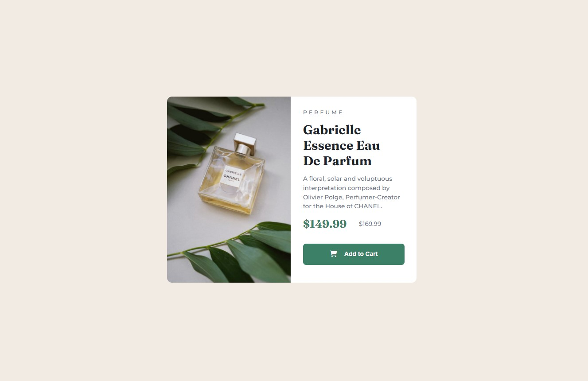
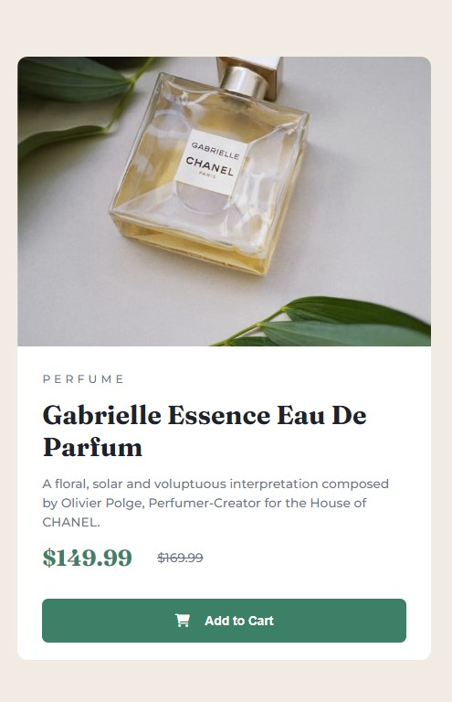

# Frontend Mentor - Product preview card component solution

This is a solution to the [Product preview card component challenge on Frontend Mentor](https://www.frontendmentor.io/challenges/product-preview-card-component-GO7UmttRfa). Frontend Mentor challenges help you improve your coding skills by building realistic projects.

## Table of contents

- [Overview](#overview)
  - [The challenge](#the-challenge)
  - [Screenshot](#screenshot)
- [My process](#my-process)
  - [Built with](#built-with)
  - [What I learned](#what-i-learned)
  - [Continued development](#continued-development)
  - [Useful resources](#useful-resources)
- [Author](#author)

**Note: Delete this note and update the table of contents based on what sections you keep.**

## Overview

### The challenge

Users should be able to:

- View the optimal layout depending on their device's screen size
- See hover and focus states for interactive elements

### Screenshot




## My process

### Built with

- Semantic HTML5 markup
- Flexbox
- CSS
- [Styled Components](https://fontawesome.com/icons/cart-shopping?s=regular&f=classic) - For cart logo

### What I learned

Using media query and the content property in css to change the images.

To see how you can add code snippets, see below:

```html

```

```css
.image-section {
  content: url(/images/image-product-mobile.jpg);
  border-top-left-radius: 8px;
  border-top-right-radius: 8px;
}
```

### Continued development

Responsive web design

### Useful resources

- (https://developer.mozilla.org/en-US/docs/Web/CSS/) - This helped me with the curved corners. I learnt that the border-top-left-radius property targets the top left only.
  It also helped with centering the entire section/div.

## Author

Richmond

- Frontend Mentor - [@xtoby-1](hhttps://www.frontendmentor.io/profile/xtoby-1)
- Tiktok - [@iconohacks](https://www.tiktok.com/@iconohacks)
